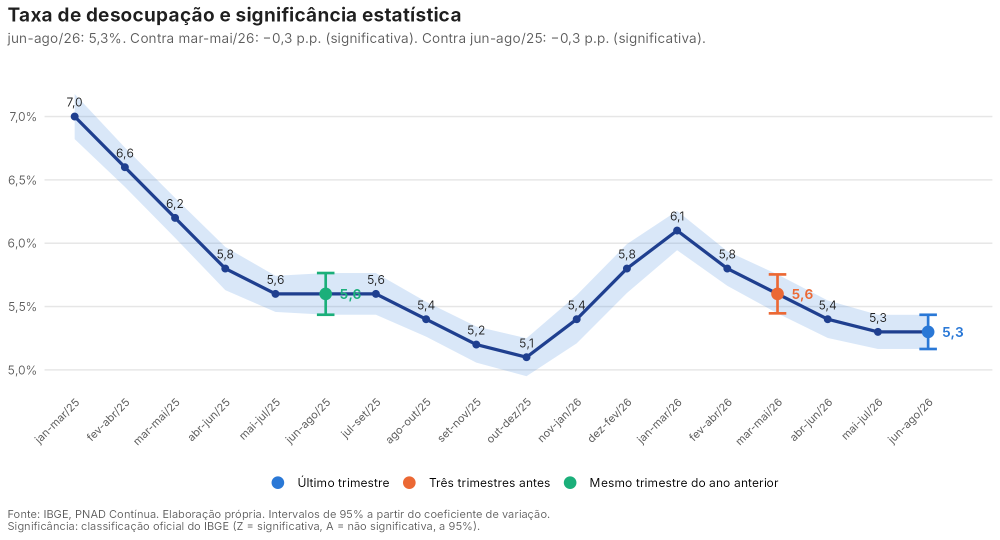
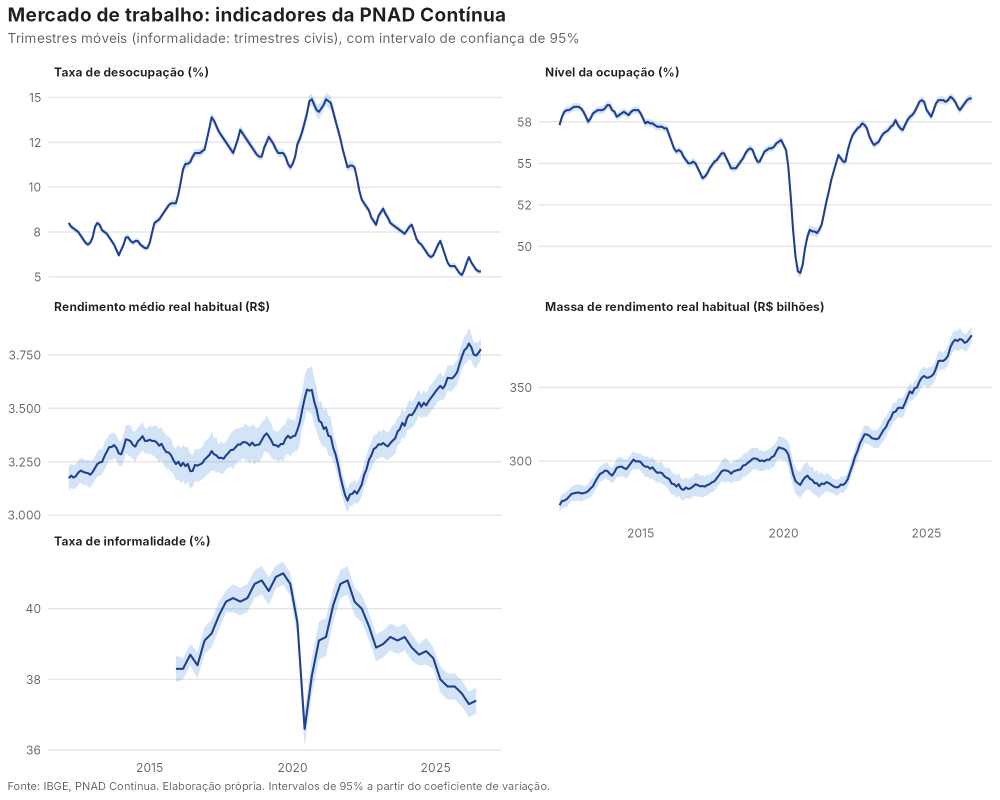

# Monitor do mercado de trabalho: PNAD Contínua com significância estatística

Acompanhamento mensal do mercado de trabalho brasileiro com atualização automática: coleta os indicadores da PNAD Contínua no IBGE e lê cada variação junto com a sua incerteza amostral, separando mudança de patamar de ruído da amostra.

📄 **[Nota do último trimestre](nota/ultima_nota.md)**



---

## O que o monitor responde

1. **A desocupação caiu ou subiu de fato?** Cada estimativa da PNAD Contínua tem um intervalo de confiança. O monitor mostra se a variação em relação a três trimestres antes e ao mesmo trimestre do ano anterior é estatisticamente significativa.
2. **A ocupação e a renda acompanham?** Nível da ocupação, rendimento médio real e massa de rendimento real, com as mesmas classificações.
3. **O emprego está ficando mais ou menos formal?** Taxa de informalidade, a cada trimestre.

## Por que olhar a significância

A PNAD Contínua é uma pesquisa por amostra: a taxa divulgada é uma estimativa, e uma variação de 0,2 ponto percentual pode ser apenas ruído amostral. Para dizer se houve mudança de patamar, é preciso olhar a variação junto com a sua margem de erro.

Duas escolhas de método vêm daí:

- **Comparar períodos sem sobreposição.** Trimestres móveis vizinhos (mar-mai e abr-jun, por exemplo) compartilham dois meses de entrevistas, então a diferença entre eles diz pouco. O monitor compara o último trimestre com o encerrado três meses antes e com o mesmo trimestre do ano anterior, como faz o IBGE.
- **Testar a diferença, e não só a sobreposição das bandas.** Bandas que não se sobrepõem indicam diferença significativa, mas bandas que se sobrepõem não indicam o contrário. O teste correto usa o intervalo de confiança da *diferença*, que considera a covariância entre as estimativas. Na PNAD Contínua essa covariância é grande, porque 4/5 dos domicílios se repetem de um trimestre para o outro (Lila e Freitas, 2007). As classificações usadas aqui são as oficiais do IBGE: **Z** indica variação significativa a 95%, e **A**, ausência de significância.

**O que os dados mostram.** O monitor compara, em toda a série, a regra visual com a classificação do IBGE. A regra visual nunca aponta mudança onde não há, mas deixa passar muitas das variações significativas. Até jun-ago/26, por exemplo, 22% das variações significativas da taxa de desocupação em relação a três trimestres antes aconteceram com as bandas sobrepostas; no rendimento médio real, 94%. A tabela atualizada está na [nota](nota/ultima_nota.md#sobreposição-das-bandas-não-é-teste).

## Indicadores

| Indicador | Periodicidade | Tabela do SIDRA |
|---|---|---|
| Taxa de desocupação | Trimestre móvel | [6381](https://sidra.ibge.gov.br/tabela/6381) |
| Nível da ocupação | Trimestre móvel | [6379](https://sidra.ibge.gov.br/tabela/6379) |
| Rendimento médio real habitual | Trimestre móvel | [6390](https://sidra.ibge.gov.br/tabela/6390) |
| Massa de rendimento real habitual | Trimestre móvel | [6392](https://sidra.ibge.gov.br/tabela/6392) |
| Taxa de informalidade | Trimestre civil | [8529](https://sidra.ibge.gov.br/tabela/8529) |

Para cada indicador, o monitor coleta a estimativa, o coeficiente de variação, as variações e as classificações de significância. O intervalo de 95% de cada estimativa é calculado a partir do coeficiente de variação: $\hat\theta \pm 1{,}96 \cdot CV \cdot \hat\theta$.



## Atualização automática

Um workflow do GitHub Actions ([`atualizar.yml`](.github/workflows/atualizar.yml)) roda nos dias úteis. Ele executa os testes, coleta os dados, regenera gráficos, tabelas e nota, e publica as mudanças quando o IBGE divulga um período novo.

## Próximos passos

Reproduzir as classificações do IBGE a partir dos microdados, com o desenho amostral da pesquisa e a covariância do painel estimada por linearização de Taylor, e aplicar o mesmo teste a recortes que o IBGE não classifica, como sexo, idade, região e posição na ocupação.

## Estrutura

```
├── R/
│   ├── coleta.R      # SIDRA: estimativas, CV e classificações Z/A
│   ├── graficos.R
│   └── nota.R
├── main.R            # executa tudo e escreve a nota
├── tests/testthat/   # teste de ponta a ponta com respostas simuladas da API
├── data/             # indicadores coletados (CSV)
├── output/           # figuras e tabelas
└── nota/             # nota do último trimestre
```

## Como reproduzir

```r
install.packages(c("httr", "jsonlite", "dplyr", "tidyr", "ggplot2", "testthat"))
```

```bash
Rscript main.R                 # coleta e gera tudo
Rscript main.R --sem-coleta    # usa os dados já coletados
```

## Referência

LILA, M. F.; FREITAS, M. P. S. *Estimação de intervalos de confiança para estimadores de diferenças temporais na Pesquisa Mensal de Emprego*. Rio de Janeiro: IBGE, 2007. (Textos para discussão. Diretoria de Pesquisas, n. 22).

## Autor

**Alexandre Saldanha**, economista e mestrando em População, Território e Estatísticas Públicas (ENCE/IBGE). [LinkedIn](https://www.linkedin.com/in/alexandre-saldanha-202a8592/) · [Lattes](http://lattes.cnpq.br/5148309722351266)

Código sob licença [MIT](LICENSE). Dados: IBGE, PNAD Contínua.
